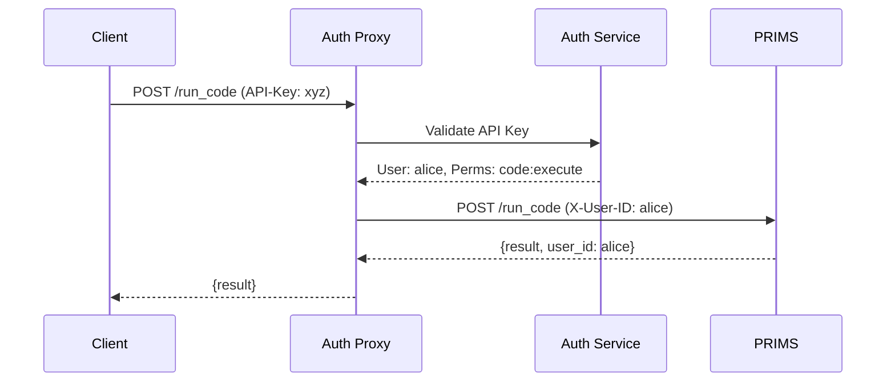
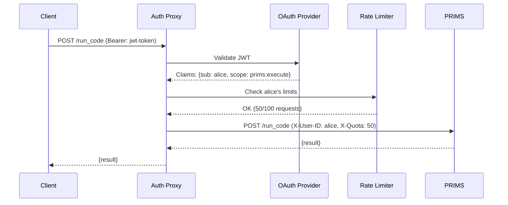

# PRIMS Authentication Architecture

## Summary: Authentication Proxy vs Direct Authentication

**Recommendation: Use Authentication Proxy/Gateway Pattern** ✅

### Why Authentication Proxy is Superior

#### 1. **Separation of Concerns**
- **PRIMS Job**: Execute Python code securely
- **Auth Proxy Job**: Handle authentication, authorization, rate limiting
- **Result**: Each component focuses on what it does best

#### 2. **Architecture Benefits**

```
❌ Monolithic (Bad):
[Client] → [PRIMS with Built-in Auth + Code Execution]

✅ Microservices (Good):
[Client] → [Auth Gateway] → [PRIMS (Code Execution Only)]
```

#### 3. **Practical Advantages**

| **Authentication Proxy** | **Direct Authentication** |
|---------------------------|----------------------------|
| ✅ Reusable across services | ❌ Tied to PRIMS only |
| ✅ Swap auth providers easily | ❌ Requires code changes |
| ✅ Industry-standard patterns | ❌ Custom implementation |
| ✅ PRIMS stays lightweight | ❌ Bloats PRIMS codebase |
| ✅ Zero downtime auth updates | ❌ PRIMS restart required |
| ✅ Multi-protocol support | ❌ Limited flexibility |

## Recommended Authentication Patterns

### 1. **Simple: Nginx + Auth Service**

```nginx
# nginx.conf
server {
    listen 443 ssl;
    server_name prims.company.com;
    
    location / {
        # Validate authentication
        auth_request /auth;
        
        # Extract user info from auth response
        auth_request_set $user_id $upstream_http_x_user_id;
        auth_request_set $org_id $upstream_http_x_org_id;
        auth_request_set $permissions $upstream_http_x_permissions;
        
        # Forward to PRIMS with user context
        proxy_pass http://prims:9000;
        proxy_set_header X-User-ID $user_id;
        proxy_set_header X-Organization-ID $org_id;
        proxy_set_header X-User-Permissions $permissions;
    }
    
    location = /auth {
        internal;
        proxy_pass http://auth-service:8080/validate;
        proxy_set_header Authorization $http_authorization;
    }
}
```

### 2. **Production: API Gateway**

```yaml
# Kong/AWS API Gateway/Envoy
apiVersion: configuration.konghq.com/v1
kind: KongPlugin
metadata:
  name: prims-auth
config:
  # OAuth 2.0 / JWT validation
  issuer: "https://company.auth0.com/"
  scopes_required: ["prims:execute"]
  # Rate limiting
  minute: 100
  policy: redis
---
apiVersion: networking.k8s.io/v1
kind: Ingress
metadata:
  annotations:
    konghq.com/plugins: prims-auth
spec:
  rules:
  - host: prims.company.com
    http:
      paths:
      - path: /
        backend:
          service:
            name: prims
            port:
              number: 9000
```

### 3. **Cloud: Managed Auth**

```yaml
# AWS Application Load Balancer with Cognito
Resources:
  PrimsALB:
    Type: AWS::ElasticLoadBalancingV2::LoadBalancer
    Properties:
      Scheme: internet-facing
      
  PrimsListener:
    Type: AWS::ElasticLoadBalancingV2::Listener
    Properties:
      DefaultActions:
      - Type: authenticate-cognito
        AuthenticateCognitoConfig:
          UserPoolArn: !Ref UserPool
          UserPoolClientId: !Ref UserPoolClient
          UserPoolDomain: company-prims
      - Type: forward
        TargetGroupArn: !Ref PrimsTargetGroup
```

## How PRIMS Changes (Minimal)

### Current PRIMS (No Auth)
```python
@mcp.tool
async def run_code(code: str) -> dict:
    return await execute_code(code)
```

### PRIMS with Auth Headers (Small Change)
```python
@mcp.tool  
async def run_code(code: str, request: Request) -> dict:
    # Extract user context from auth proxy headers
    user_id = request.headers.get("x-user-id")
    permissions = request.headers.get("x-user-permissions", "").split(",")
    
    # Simple authorization check
    if "code:execute" not in permissions:
        raise PermissionError("Code execution not allowed")
    
    # Execute with user isolation
    return await execute_code(code, user_id=user_id)
```

## Authentication Flow Examples

### 1. **API Key Flow**


### 2. **OAuth 2.0 Flow**


## Implementation Timeline

### Phase 1: Header-Based Auth (1 week)
- [ ] Add auth context extraction to PRIMS
- [ ] Implement basic permission checks
- [ ] Update artifact serving with user isolation

### Phase 2: Nginx Auth Proxy (1 week)
- [ ] Deploy nginx with auth_request
- [ ] Create simple auth service (API keys)
- [ ] Test end-to-end flow

### Phase 3: Production Auth (2 weeks)
- [ ] Integrate with OAuth provider (Auth0/Okta)
- [ ] Add rate limiting and quotas
- [ ] Implement audit logging

### Phase 4: Enterprise Features (1 week)
- [ ] Multi-tenancy support
- [ ] Admin dashboard
- [ ] Usage analytics

## Security Benefits

### 1. **Defense in Depth**
```
Internet → WAF → Load Balancer → Auth Proxy → PRIMS
         ↓      ↓               ↓            ↓
       DDoS   SSL/TLS       Auth/Authz   Sandbox
```

### 2. **Principle of Least Privilege**
- **Auth Proxy**: Only knows about users and permissions
- **PRIMS**: Only knows about code execution
- **Neither**: Has complete attack surface

### 3. **Auditability**
```
Auth Proxy Logs: Who accessed what when
PRIMS Logs: What code was executed by whom
Combined: Complete audit trail
```

## Conclusion

**Authentication proxy pattern is definitively superior** for PRIMS because:

1. **Maintains PRIMS simplicity** - stays focused on code execution
2. **Industry standard** - proven pattern used by major platforms
3. **Flexible and reusable** - works with any auth provider
4. **Better security** - specialized auth components
5. **Easier operations** - independent scaling and updates

The authentication issue should implement **Phase 1** (header-based auth context) in PRIMS, while recommending users deploy behind an authentication proxy for production use.